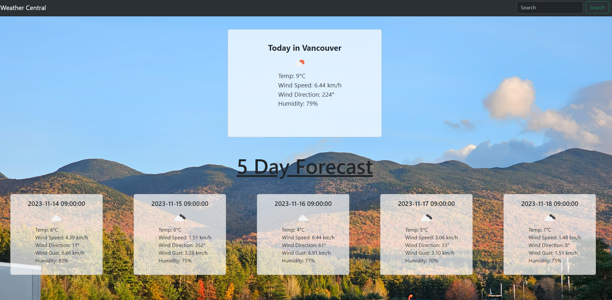

# Module6_Weather_In_Your_City
```
Welcome to Weather Central! Your one-stop-shop for finding the weather in any city around the world!

-The website features a search bar where you input the city of choice, then the day's forecast is presented to you along with the next 5 days. 
-Temperature is communicated in celsius, an easy to understand icon of weather conditions, wind speeds in km/h, and humidity in percentage. 
-The layout is clean and user friendly. 
-The website stores past city searches in the search dropdown for user convenience.   

```

# Requirements Given:
```
GIVEN a weather dashboard with form inputs
WHEN I search for a city, THEN I am presented with current and future conditions for that city and that city is added to the search history.

WHEN I view current weather conditions for that city, THEN I am presented with the city name, the date, an icon representation of weather conditions, the temperature, the humidity, and the wind speed.

WHEN I view future weather conditions for that city, THEN I am presented with a 5-day forecast that displays the date, an icon representation of weather conditions, the temperature, the wind speed, and the humidity.

WHEN I click on a city in the search history, THEN I am again presented with current and future conditions for that city.

```


# Link to the website found below:
```
https://waltscode.github.io/Module6_Weather_In_Your_City/ 

```


# Screenshot found below:

Fun fact: I took the photo in the background when I was in New Hampshire last month!



